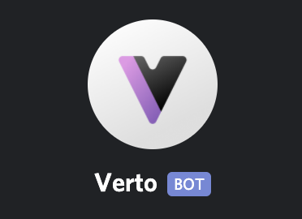

<p align="center">
  <a href="https://verto.exchange">
    
  </a>

  <h3 align="center">Verto</h3>

  <p align="center">
    A decentralized token exchange protocol on Arweave
  </p>
</p>

## About

This repository holds the serverless Vercel API responsible for relaying newly-created swaps to the [Verto Community Discord](https://discord.gg/sNgJkMg).

## Guide

To build/use the service on localhost, you will have to download Node, and install the yarn package manager (`npm i -g yarn`). When you have these, clone this repository and run `yarn` to add the required dependencies.

### Debug

```sh
vercel dev
```

## Contributing

Any contributions are very much welcomed. Feel free to fork and make a PR with any additions (or fixes)!

## License

The code contained within this repository is licensed under the MIT license.
See [`./LICENSE`](../LICENSE) for more information.